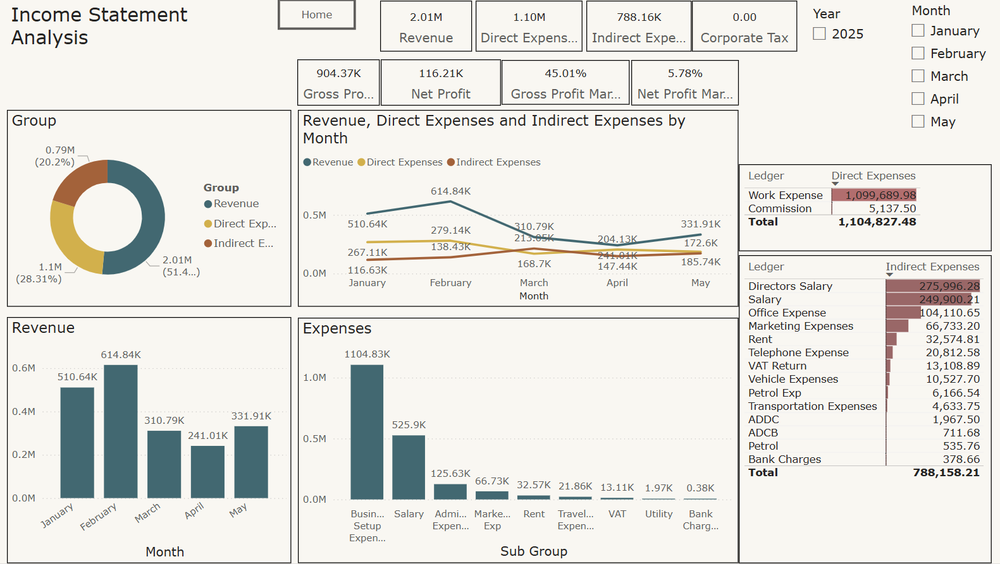

# 📊 Income Statement Analysis Dashboard

## 📌 Project Overview
This Power BI dashboard provides an interactive monthly analysis of a company's **Income Statement** for the year 2025. It visualizes **Revenue**, **Direct Expenses**, **Indirect Expenses**, and calculates key performance metrics such as **Gross Profit**, **Net Profit**, and **Profit Margins**. 

> 🗓️ Date Completed: 2025  
> 👨‍💼 Role: Data Analyst / Financial Analyst  
> 🛠️ Tools: Power BI

---

## 📈 Key Metrics Summary
| Metric               | Value       |
|----------------------|-------------|
| 💰 Total Revenue     | 2.01M       |
| 📉 Direct Expenses   | 1.10M       |
| 📊 Indirect Expenses | 788.16K     |
| 🧾 Gross Profit      | 904.37K     |
| 📌 Net Profit        | 116.21K     |
| 📈 Gross Profit %    | 45.01%      |
| 📉 Net Profit %      | 5.78%       |
| 🏢 Corporate Tax     | 0.00        |

---

## 🔍 Visual Insights

### 🟦 Revenue vs Expenses by Month
- Peak revenue in **February**: 614.84K.
- Revenue dropped significantly in **March & April**.
- Direct and indirect expenses remain relatively stable throughout.

### 🟨 Expense Breakdown
- **Direct Expenses**: 
  - Work Expense: 1.09M  
  - Commission: 5.13K  
- **Indirect Expenses**: 
  - Director’s Salary: 275.99K  
  - Staff Salary: 249.90K  
  - Office Expense: 104.11K  
  - Marketing & Rent: 66.73K + 32.57K  

### 🧁 Expense Groups (Donut Chart)
- Revenue: 51.4%  
- Direct Expenses: 28.3%  
- Indirect Expenses: 20.2%  

---

## 🖥️ Visual Components
- 📊 Line Chart: Revenue vs. Direct & Indirect Expenses (Month-wise)
- 📈 Bar Charts:
  - Monthly Revenue Trend
  - Expense by Subgroup
- 🍩 Donut Chart: Expense Distribution by Category
- 📋 Tables: 
  - Direct Expenses (Ledger-level)
  - Indirect Expenses (Ledger-level)

---

## 🛠️ Skills Demonstrated
- Financial Statement Analysis  
- Power BI Dashboard Design  
- Data Modeling & DAX  
- KPI Calculation & Margin Analysis  
- Business Storytelling Through Visuals  

---

## 📈 Business Use Case
- Helps stakeholders monitor and control operational expenses.
- Provides month-wise financial performance trends.
- Aids in identifying cost-heavy areas and optimizing them.
- Supports CFOs and finance teams in data-driven budgeting.

---

## 📁 Project Files
- `income_statement.png`: Dashboard Screenshot  
- `README.md`: Documentation  
- Optional `.pbix`: Power BI Dashboard File

---

> ✉️ For queries or collaboration, feel free to reach out: [YourEmail@example.com]
